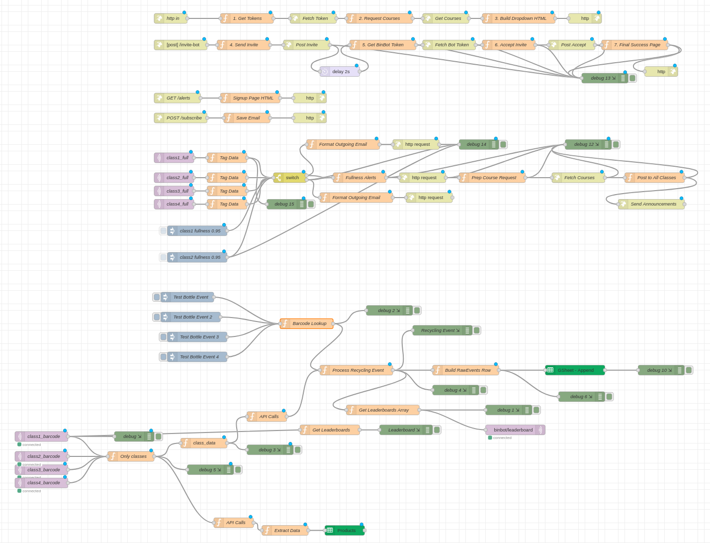

# IOT_BinBot

### Json File
The Node-RED flow configuration is stored in [`final_flow.json`](./final_flow.json). To view and use this flow:

1. Open Node-RED in your browser (typically at `http://localhost:1880`)
2. Click the menu icon (☰) in the top-right corner
3. Select **Import** and **Select a file to import**
4. Choose the `final_flow.json` file from this repository
5. Click **Import**

The flow will be loaded into your Node-RED workspace and is ready to use.

For local setup instructions, see the [Node-RED Getting Started guide](https://nodered.org/docs/getting-started/local) for Docker and local installation options.

The imported flow should look like this:

### Microbit Code

Code for microbits can be accessed in [`Microbit_Code_Links.md`](./Microbit_Code_Links.md). The file contains two links, one for the master board and one for the slave board.
